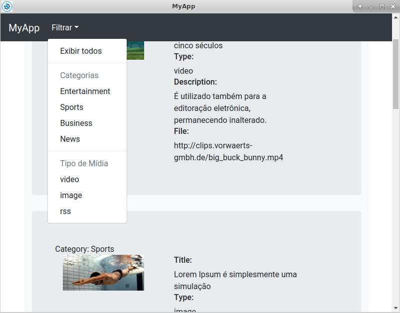

# MyAppNodeNW

  
  Aplicativo desenvolvido utilizando NodeJS + biblioteca 'nw.js'.

  ### Funcionalidade
  Buscar conteudo na URL especificada (API) e apresentar essas informações para o usuário.

  ### URL API
  Exemplo para testes (conteudo JSON):
   - URL = https://raw.githubusercontent.com/iantonini/MyAppNodeNW/master/exemplo.html

## Configurar Ambiente (Usando Linux Debian/Ubuntu)

  ### Instalar NodeJS + NWjs + Dependencias
    - sudo apt-get install python-software-properties 
    - curl -sL https://deb.nodesource.com/setup_9.x | sudo -E bash -
    - sudo apt-get install -y nodejs
    - sudo apt-get install -y build-essential

    Verificar as versões instaladas
    - node -v
    - npm -v

  ### Criar Projeto
    Criar Diretório para o APP
    - mkdir MyAppNodeNW

    Acessar o novo diretório
    - cd MyAppNodeNW

    Clonar o repositório
    - git clone https://github.com/iantonini/MyAppNodeNW.git .

    Instalar dependências do NodeJS
    - npm i --production

  ### Executar Aplicativo (sem complilar)
    Acessar o diretório do aplicativo
    - cd MyAppNodeNW

    Executar NW para iniciar APP
    - node_modulo/.bin/nw . 

  ### Complilar Aplicativo (Linux32, Linux64, Win32, Win64, OSX32, OSX64)
    Acessar o diretório do aplicativo
    - cd MyAppNodeNW

    Executar o nw-builder de acordo com a plataforma desejada
        Linux32
        - node_modules/.bin/nwbuild -plinux32 .

        Linux64
        - node_modules/.bin/nwbuild -plinux64 .

        Win32
        - node_modules/.bin/nwbuild -pwin32 .

        Win64
        - node_modules/.bin/nwbuild -pwin64 .

        OSX32
        - node_modules/.bin/nwbuild -posx32 .

        OSX64
        - node_modules/.bin/nwbuild -posx64 .

    Acessar pasta com os executaveis de acordo com a plataforma desejada.
    - cd build/MyAppNodeNW/[Linux32,Linux64,Win32,Win64,OSX32,OSX64]

    Dentro da pasta da plataforma escolhida tem o arquivo executavel com o nome da aplicação.

## Links Referências
 - https://nodejs.org/en/
 - https://nwjs.io/
 - https://github.com/nwjs-community/nw-builder

